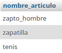
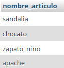

# sistemas para una zapateria 

## Modelo Entidad_relacion

## Modelo Fisico de la BD

## tabla fabricante

## articulo 

## consultas a la bd

1. Mostrar la lista de todos datos de los fabricantes

`SELECT * FROM fabricante;`

2. Mostrar la lista de nombres de los fabricantes 

`SELECT nombre_fabricante AS fabricante FROM fabricante;`

3. Mostrar los nombres de los productos.

`SELECT nombre_articulo FROM * articulo`

4. mostrar los precios de los nombres de los productos

`SELECT nombre_articulo AS Nombre, precio_articulo AS Precio FROM Articulo;`

5. Obtener los nombres de los articulos cuyos precios son mayores a 50000

6. Obtener el nombre de los articulos entre los precios 5000 y 40000 (ambos incluidos)

`SELECT nombre_articulo FROM articulo WHERE precio_articulo >= 5000 AND precio_articulo <= 40000;`

